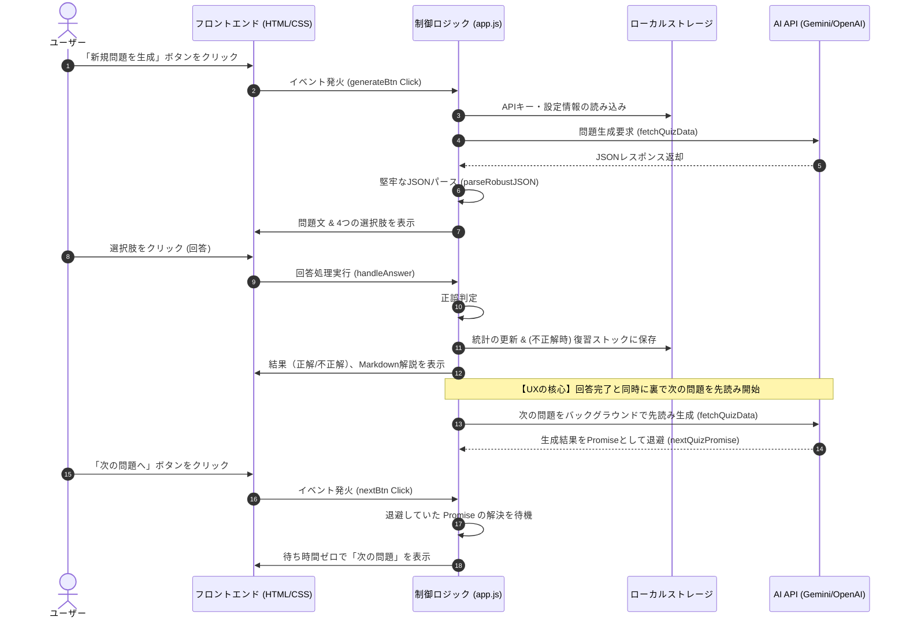

# QuaGenius (v1.6) - システム設計書・設計図

『QuaGenius』は、AI（Google Gemini 2.5 Flash または OpenAI GPT-4o-mini）のパワーを最大限に活用し、**「中小企業診断士」**および**「FP1級」**の資格試験対策用過去問を動的に自動生成する高精度な過去問ジェネレーターです。

本ドキュメントでは、現在のアプリケーション（HTML/CSS/Javascript）の実装内容を分析し、そのシステム構造、データモデル、UX設計、AIプロンプトエンジニアリングの仕組みを設計図としてまとめました。

---

## 1. システム全体像 & アーキテクチャ

本アプリは、バックエンドサーバーを持たない**完全フロントエンド完結型（サーバーレスSPA）**のWebアプリケーションです。ユーザーのブラウザ上で全ての制御を行い、AIモデルへのリクエストはユーザー自身が提供するAPIキーを利用して直接APIを呼び出すセキュアな設計になっています。

### 📌 処理フロー（シーケンス図）

メイン画面での「問題生成 ➔ 回答 ➔ バックグラウンド先読み」の美しいUX処理フローは以下の通りです。



---

## 2. フォルダ & ファイル構造

プロジェクトは極めてシンプルかつ効率的な3ファイル構成です。

```
ai-quiz-app/
├── index.html       # アプリケーションのUI構造定義 (API設定、問題表示、成績モーダル等)
├── style.css        # ガラスモーフィズムとダークモードを採用したレスポンシブCSS
└── app.js           # アプリの全状態管理、API通信、UIバインディング、ローカルストレージ操作
```

### 各ファイルの役割詳細

| ファイル名 | 主要技術・外部ライブラリ | 役割 |
| :--- | :--- | :--- |
| **`index.html`** | - Google Fonts (Inter, Noto Sans JP)<br>- Marked.js (Markdownパーサー) | UIの骨組み、モーダルウィンドウ（API設定、成績・統計）、各種ボタン、トースト通知、表示コンポーネントの配置。 |
| **`style.css`** | CSS3 (カスタム変数、Flexbox/Grid、キーフレームアニメーション) | ガラスモーフィズム（`backdrop-filter`）、ダークテーマ、ボタンのマイクロインタラクション、レスポンシブ対応（スマホ表示対応）。 |
| **`app.js`** | Vanilla JS (ES6+, Fetch API, LocalStorage) | 試験科目・分野データ定義、AI APIクライアント（Gemini & OpenAI）、先読み（Pre-fetching）制御、エラー復旧リトライ、成績統計処理。 |

---

## 3. データ設計 & データモデル

ローカルストレージとAPI通信におけるデータスキーマの定義です。

### 3.1. ローカルストレージ (データ永続化)

本アプリでは、以下の情報がブラウザの `localStorage` に安全に保管されます。

#### ① API設定
*   `ai_engine`: `"gemini"` または `"openai"` （選択されたAIエンジン）
*   `gemini_api_key`: Google AI Studioから取得したAPIキー (`AIzaSy...`)
*   `openai_api_key`: OpenAIから取得したAPIキー (`sk-proj-...`)

#### ② 統計データ (`quagenius_stats`)
ユーザーの学習進捗と正答率を分野別に可視化するためのオブジェクト。
```json
{
  "total": 12,      // 総回答数
  "correct": 8,     // 総正解数
  "categories": {   // 分野ごとの戦績 (キー形式: {試験コード}_{分野名})
    "sme_財務・会計": { "total": 5, "correct": 3 },
    "fp1_相続・事業承継": { "total": 7, "correct": 5 }
  }
}
```

#### ③ 復習ストック (`quagenius_mistakes`)
間違えた問題のオブジェクト配列。復習モードでランダムに出題され、正解するとここから削除（消化）されます。
```json
[
  {
    "exam": "sme",
    "category": "財務・会計",
    "question": "資本収益性を測定する指標として、最も不適切なものはどれか。",
    "options": ["ROA", "ROE", "自己資本比率", "総資産回転率"],
    "correct_index": 2,
    "explanation": "【出題の趣旨】\n資本収益性指標の分類について理解を問う問題です...\n\n【各選択肢の解説】\n**選択肢3**\n自己資本比率\n**判定：【不適切】**\n自己資本比率は「安全性」を測定する指標であり、収益性指標ではありません..."
  }
]
```

### 3.2. AIレスポンス JSON スキーマ

AIエンジンから返却させるための構造化データ定義。APIの `responseMimeType` (Gemini) や `response_format` (OpenAI) を用いて、厳密なJSON形式で出力させます。

```json
{
  "$schema": "http://json-schema.org/draft-07/schema#",
  "type": "object",
  "properties": {
    "question": {
      "type": "string",
      "description": "試験レベルの日本語の問題文"
    },
    "options": {
      "type": "array",
      "items": { "type": "string" },
      "minItems": 4,
      "maxItems": 4,
      "description": "4択の選択肢"
    },
    "correct_index": {
      "type": "integer",
      "minimum": 0,
      "maximum": 3,
      "description": "正解となる選択肢のインデックス (0〜3)"
    },
    "explanation": {
      "type": "string",
      "description": "Markdown形式でマークアップされた詳細な解説"
    }
  },
  "required": ["question", "options", "correct_index", "explanation"]
}
```

---

## 4. コア機能の設計仕様

### 4.1. 動的 AI 問題生成エンジン (API連携)
*   **エンジン切り替え**: 費用をかけずに使いたいユーザー向けの「Gemini 2.5 Flash (無料)」と、高品質なテキスト生成に強みを持つ「GPT-4o-mini (有料)」をトグル式で選択可能。
*   **自動リトライ機能 (Auto-Retry)**: 通信状況や瞬間的なレートリミット（HTTP 429）を考慮し、**「3秒待機 ➔ 再試行（最大2回）」**の自動エラー修復アルゴリズムが組み込まれています。
*   **ロバストJSONパーサー (`parseRobustJSON`)**: AIが稀に出力してしまうマークダウン装飾（````json ... ````）や前後の余計な挨拶文字列を正規表現とインデックススキャンで削ぎ落とし、確実にJSONデータをパースする自己防御設計。

### 4.2. 超快適なバックグラウンド「先読み」UX
一般的なクイズアプリは回答後に「次へ」を押した瞬間にAPI通信を行うため、数秒の読込待機（ストレス）が発生します。
*   **実装アプローチ**: 本アプリでは、ユーザーが現在の問題の選択肢をクリックした（回答した）瞬間に、裏で非同期に `fetchQuizData()` を呼び出し、その実行中Promiseを `nextQuizPromise` に一時退避します。
*   **結果**: ユーザーがじっくり解説を読んでいる間に生成が完了するため、「次の問題へ」ボタンをクリックした際は**ロード時間ほぼゼロ（ミリ秒単位）**で次の問題が即時展開されます。

### 4.3. 復習モード (Spaced Repetition の簡易実装)
*   **ストック化**: 新規問題で不正解になった問題は、自動的に `localStorage` の `mistakes` 配列に追加されます。
*   **消化型学習**: 「復習モード」では、このストックの中からランダムに問題が出題されます。ユーザーがその問題に**正解した場合のみ、ストックから自動的に削除**されます。これにより、「苦手な問題だけが手元に残り、できるようになったら消える」という理想的な弱点克服サイクルを実現しています。

### 4.4. 分野別ビジュアル成績ダッシュボード
*   **進捗可視化**: 過去の全回答履歴から「総出題数」と「総合正答率」をリアルタイム計算。
*   **カラーゲージによる直感的な弱点把握**:
    *   正答率 **80%以上**: 🟢 グリーン（合格圏内・安全）
    *   正答率 **50%以上 80%未満**: 🟡 イエロー（要補強・注意）
    *   正答率 **50%未満**: 🔴 レッド（苦手分野・危険）
*   **ソート機能**: 苦手な分野（正答率が低い順）にリストが自動ソートされるため、復習すべき分野が一目でわかります。

---

## 5. AIプロンプト設計 (メタエンジニアリング)

AIに対して「本物の講師」としての役割を与え、解説のフォーマットと最新法令への準拠を徹底させるプロンプト設計です。

```
【プロンプト構造】
1. 役割定義: 「{資格名}」の専門講師
2. タスク定義: 「{分野名}」の過去問傾向に沿った実践的な4択問題の作成
3. 構造制約: 4つの選択肢、正解インデックスの指定
4. 解説フォーマットの絶対遵守:
   - 【出題の趣旨】(要改行、核心部分の解説)
   - 【各選択肢の解説】(各選択肢の適切・不適切判定と長文による詳細な理由付け)
   - 【ワンポイントアドバイス】(実務や試験対策に役立つTips)
5. 最新法令準拠指示: 最新の法令・税制（現在施行されている基準）に完全に準拠させる
6. 計算・グラフ問題オプション (チェック時追加): 
   「必ず具体的な数値を用いた計算問題、または表やデータを用いた分析問題を出題してください」
7. JSON出力フォーマットの指定
```

---

## 6. デザインシステム & 視覚表現 (UI/UX)

『QuaGenius』は、洗練されたモダンなデザインシステムと細やかなマイクロインタラクションによって、ユーザーの学習意欲を高める工夫が施されています。

### 🎨 カラーパレット
*   **Background (背景)**: `#0f172a` (深みのあるSlateカラー) ＋ 美しい3色のグラデーション（パープル、ディープブルー、マゼンタ）がブレンドされ、高級感のあるビジュアルを構成。
*   **Primary (テーマ色)**: `#6366f1` (インディゴ・ハイテックブルー) ➔ ホバー時に `#4f46e5` へ美しく遷移。
*   **Card (コンポーネント)**: `rgba(30, 41, 59, 0.7)` (半透明) + `backdrop-filter: blur(12px)` による高品質な**ガラスモーフィズム (Glassmorphism)**。
*   **Success / Error**: `emerald` (`#10b981`) と `rose` (`#ef4444`) を使用し、知的で洗練されたフィードバックを表現。

### 💫 アニメーション & インタラクション
*   **カード表示アニメーション**: 新しい問題が表示される際、下からふわっと浮き上がる滑らかなフェードインアニメーション (`slideUp`) を実行。
*   **ホバーエフェクト**: 選択肢ボタンにカーソルを合わせると、背景の不透明度が上がり、境界線の色が変わることでクリック可能であることを直感的に伝達。
*   **アクションボタン**: 押した瞬間にわずかに沈み込む（`translateY(-2px)` からホバー時の浮き上がりへの反発）感覚をCSS Transitionで実装し、プレミアムなアプリ感を実現。
